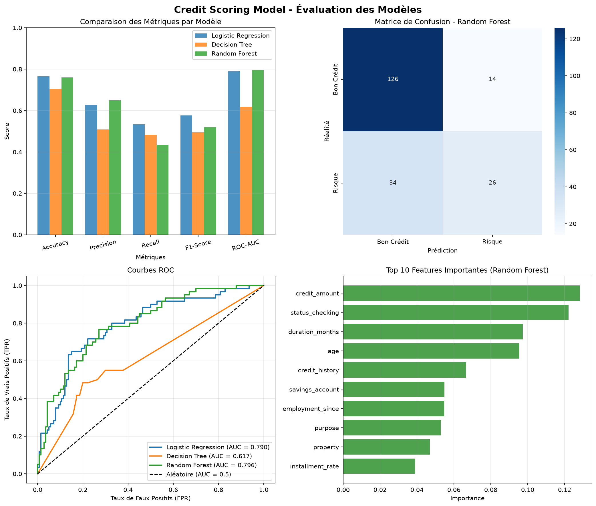

#  Credit Scoring Model — CodeAlpha

Ce projet fait partie du stage CodeAlpha en Machine Learning. Il implémente un système de scoring de crédit pour évaluer le risque de défaut de paiement des emprunteurs en comparant plusieurs modèles de classification supervisée.

---

##  Table des matières
1. [Présentation du projet](#-présentation-du-projet)
2. [Dataset](#-dataset)
3. [Architecture & Méthodologie](#-architecture--méthodologie)
4. [Modèles Entraînés](#-modèles-entraînés)
5. [Installation et Utilisation](#-installation-et-utilisation)
6. [Résultats et Évaluation](#-résultats-et-évaluation)

---

##  Présentation du projet
L'évaluation du crédit (Credit Scoring) est un outil crucial pour les institutions financières afin de décider d'accorder ou non un prêt. L'objectif est d'analyser les attributs financiers et démographiques d'un client pour prédire sa probabilité de défaut.

Ce script compare trois algorithmes classiques de classification :
*   **Régression Logistique** (comme baseline linéaire)
*   **Arbre de Décision** (modèle non linéaire et interprétable)
*   **Forêt Aléatoire (Random Forest)** (ensemble de modèles pour réduire l'overfitting)

---

##  Dataset
Le projet utilise le **German Credit Dataset** de l'UCI Machine Learning Repository.
*   **Taille :** 1000 clients (échantillons)
*   **Attributs (Features) :** 20 variables décrivant la situation financière (montant du crédit, statut du compte, historique de crédit, durée, etc.) et personnelles (âge, statut marital, emploi, logement).
*   **Variable cible (`credit_risk`) :** 
    *   `0` : Bon crédit (faible risque de défaut)
    *   `1` : Mauvais crédit / Risque de défaut (default risk)

*Note : Le script télécharge automatiquement le dataset depuis l'UCI. En cas de problème de connexion, il bascule sur un générateur de dataset synthétique réaliste.*

---

##  Architecture & Méthodologie

Le pipeline de Machine Learning est structuré comme suit :
1.  **Chargement des données :** Téléchargement et parsing du format de fichier brut (séparateur d'espace).
2.  **Exploration des données (EDA) :** Visualisation de la distribution des classes (le dataset réel présente un déséquilibre avec ~70% de bons crédits et ~30% de risques de défaut).
3.  **Prétraitement :**
    *   **Encodage :** Encodage des étiquettes textuelles catégorielles en valeurs numériques via `LabelEncoder`.
    *   **Séparation des données :** Division en ensembles d'entraînement (80%) et de test (20%) avec stratification pour conserver le ratio de classes.
    *   **Standardisation :** Normalisation des variables numériques avec `StandardScaler` (requis pour la Régression Logistique).
4.  **Entraînement des modèles :** Entraînement en parallèle des 3 algorithmes.
5.  **Évaluation :** Calcul des métriques de performance et traçage des courbes ROC.

---

##  Modèles Entraînés

*   **Régression Logistique (Logistic Regression) :**
    *   Entraîné sur des variables standardisées.
    *   Excellente baseline, rapide à exécuter et très interprétable.
*   **Arbre de Décision (Decision Tree) :**
    *   Hyperparamètres contrôlés (`max_depth=10` pour éviter le surapprentissage).
*   **Forêt Aléatoire (Random Forest) :**
    *   `n_estimators=100` (100 arbres de décision individuels).
    *   `max_depth=10` pour limiter le surapprentissage tout en capturant les interactions complexes.

---

##  Installation et Utilisation

### Prérequis
Assurez-vous d'avoir configuré l'environnement virtuel racine et installé les dépendances (`scikit-learn`, `pandas`, `numpy`, `matplotlib`, `seaborn`).

### Exécution du script
Pour lancer l'analyse et l'entraînement :
```bash
cd CodeAlpha_CreditScoring
python credit_scoring.py
```

---

##  Résultats et Évaluation

Le script évalue les modèles sur le jeu de test (200 clients) avec les métriques suivantes :
*   **Exactitude (Accuracy) :** Taux global de prédictions correctes.
*   **Précision (Precision) :** Capacité à ne pas prédire un bon client comme risqué à tort.
*   **Rappel (Recall) :** Capacité à détecter le maximum de clients à risque de défaut.
*   **F1-Score :** Moyenne harmonique de la précision et du rappel.
*   **ROC-AUC :** Aire sous la courbe ROC, mesurant la capacité de discrimination globale du modèle.

### Courbe ROC (Receiver Operating Characteristic)
Une courbe ROC comparant la performance des 3 modèles est automatiquement générée et enregistrée sous le nom de **`credit_scoring_results.png`** à la racine de ce sous-dossier.



Exemple typique d'évaluation :
*   Le modèle **Random Forest** et la **Régression Logistique** affichent généralement les meilleurs scores ROC-AUC, le Random Forest capturant mieux les relations non-linéaires du dataset German Credit.
