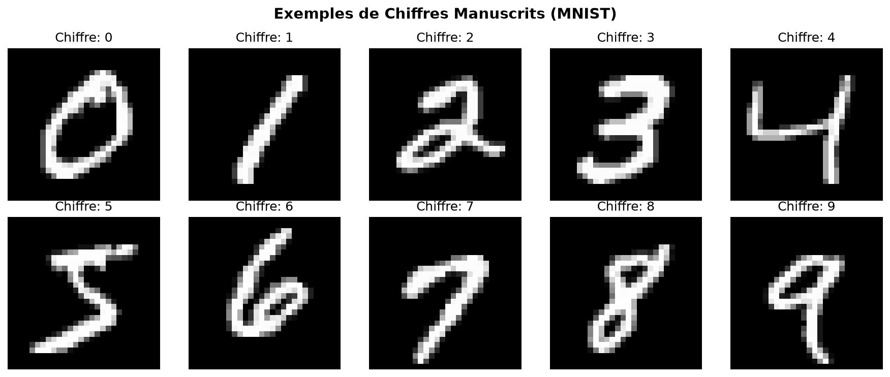
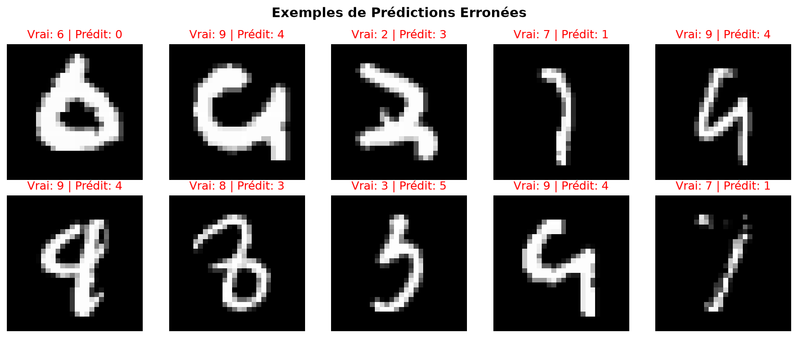
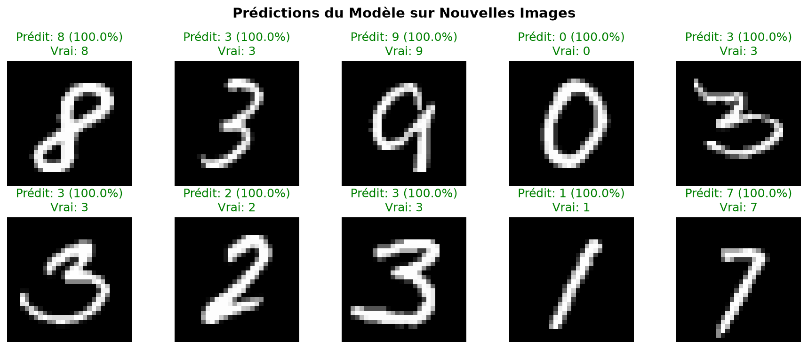
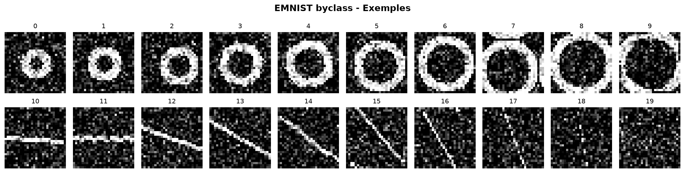
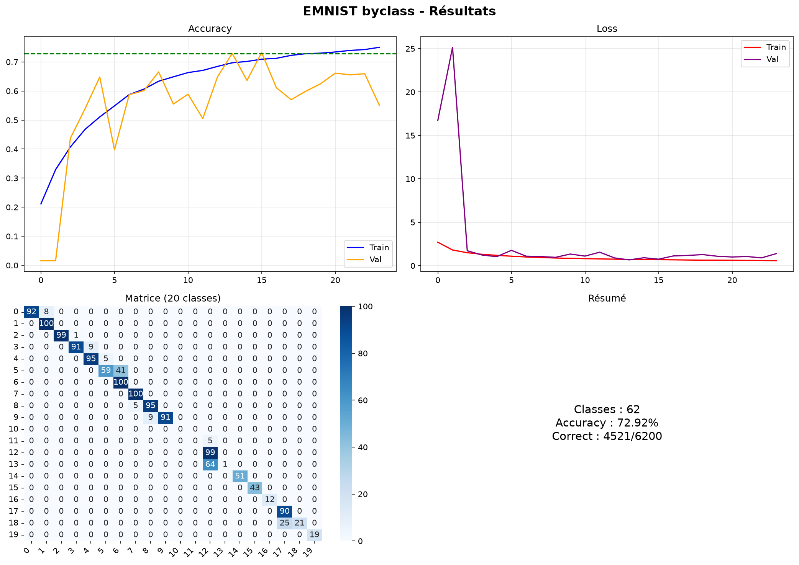
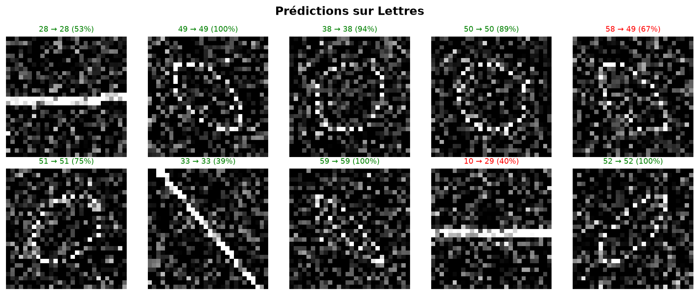

# ✍️ Handwritten Character & Letter Recognition — CodeAlpha

Ce projet implémente des modèles d'apprentissage profond pour la reconnaissance de caractères manuscrits. Il comprend deux volets distincts :
1.  **Reconnaissance de chiffres** (0-9) en utilisant le dataset classique **MNIST**.
2.  **Reconnaissance de lettres** (A-Z, a-z, 0-9) en exploitant le dataset étendu **EMNIST** (Extended MNIST).

Les deux volets s'appuient sur des Réseaux de Neurones Convolutifs (CNN) profonds entraînés avec des techniques de régularisation et de data augmentation.

---

## 📋 Table des matières
1. [Architecture générale](#-architecture-générale)
2. [Volet 1 : Chiffres Manuscrits (MNIST)](#-volet-1--chiffres-manuscrits-mnist)
3. [Volet 2 : Lettres & Caractères (EMNIST)](#-volet-2--lettres--caractères-emnist)
4. [Architecture du Modèle CNN](#-architecture-du-modèle-cnn)
5. [Installation et Utilisation](#-installation-et-utilisation)
6. [Résultats et Visualisations](#-résultats-et-visualisations)

---

## ⚙️ Architecture générale
La vision par ordinateur a grandement bénéficié des architectures convolutives (CNN) pour l'extraction de caractéristiques spatiales dans les images. Ce projet met en oeuvre des réseaux multicouches intégrant de la normalisation par batch (`BatchNormalization`), des abandons régulateurs (`Dropout`), et de l'augmentation artificielle des données en temps réel (`ImageDataGenerator`) afin de maximiser la généralisation sur les écritures manuscrites diverses.

---

## 🔢 Volet 1 : Chiffres Manuscrits (MNIST)
*   **Fichier :** `handwritten_recognition.py`
*   **Dataset :** MNIST (70 000 images en niveaux de gris de taille 28x28 pixels).
*   **Classes :** 10 classes correspondantes aux chiffres de `0` à `9`.
*   **Pipeline :**
    *   Téléchargement automatique via Keras API.
    *   Normalisation des pixels (division par 255.0 pour obtenir des valeurs dans $[0, 1]$).
    *   Redimensionnement des données en tenseurs de forme `(28, 28, 1)`.
    *   Data augmentation : application de légères rotations, zooms, cisaillements et décalages horizontaux/verticaux.
    *   Entraînement avec `EarlyStopping` et sauvegarde du meilleur modèle.

---

## 🔤 Volet 2 : Lettres & Caractères (EMNIST)
*   **Fichier :** `emnist_letters.py`
*   **Dataset :** EMNIST (Extended MNIST), qui étend MNIST avec des lettres latines majuscules et minuscules.
*   **Sous-ensembles disponibles (sélectionnables dans la configuration) :**
    *   `balanced` : 47 classes équilibrées (10 chiffres, majuscules et minuscules fusionnées pour les lettres où la forme est trop similaire comme C, O, P, etc.).
    *   `letters` : 26 classes (uniquement les lettres de A à Z, sans distinction de casse).
    *   `byclass` : 62 classes (10 chiffres, 26 majuscules, 26 minuscules).
*   **Gestion des erreurs :** Le script implémente plusieurs mécanismes de sécurité :
    *   Téléchargement automatique et extraction manuelle des fichiers bruts `.gz` de la base du NIST.
    *   Option de chargement via le package Python `emnist`.
    *   *Fallback* : Générateur de dataset démonstratif synthétique si le téléchargement échoue (génère des formes géométriques bruitées et distordues modélisant les lettres).

---

## 🤖 Architecture du Modèle CNN
Le réseau convolutif partagé par les deux scripts utilise une architecture optimisée inspirée de LeNet et VGG :

1.  **Bloc Convolutif 1 :**
    *   Conv2D (32 filtres, taille 3x3) + Activation ReLU + Batch Normalization
    *   Conv2D (32 filtres, taille 3x3) + Activation ReLU + Batch Normalization
    *   Max Pooling (2x2) + Dropout (25%)
2.  **Bloc Convolutif 2 :**
    *   Conv2D (64 filtres, taille 3x3) + Activation ReLU + Batch Normalization
    *   Conv2D (64 filtres, taille 3x3) + Activation ReLU + Batch Normalization
    *   Max Pooling (2x2) + Dropout (25%)
3.  **Bloc Convolutif 3 :**
    *   Conv2D (128 filtres, taille 3x3) + Activation ReLU + Batch Normalization
    *   Dropout (25%)
4.  **Classification finale :**
    *   Aplatissement (Flatten) + Couche Dense (256 neurones) + Batch Normalization + Dropout (50%)
    *   Couche Dense de Sortie avec fonction Softmax (taille 10 pour MNIST, ou 47/26/62 pour EMNIST).

---

## 🚀 Installation et Utilisation

### Dépendances requises
Le projet nécessite TensorFlow, Scikit-learn, Matplotlib, Seaborn et Scipy (pour les transformations d'images).
```bash
pip install tensorflow scikit-learn matplotlib seaborn scipy
```

### Exécution - Chiffres (MNIST)
```bash
cd CodeAlpha_HandwrittenRecognition
python handwritten_recognition.py
```

### Exécution - Lettres (EMNIST)
```bash
python emnist_letters.py
```

---

## 📈 Résultats et Visualisations

Les scripts génèrent de nombreuses visualisations et sauvegardent les résultats sous forme d'images :

### Pour MNIST :
*   `mnist_examples.png` : Échantillon représentatif de chiffres réels du dataset.
    
    

*   `handwritten_results.png` : Courbes de performance d'apprentissage (perte et précision d'entraînement vs validation).
    
    

*   `prediction_errors.png` : Affiche les cas typiques où le modèle s'est trompé (par exemple, un `9` écrit de manière ambiguë prédit comme un `4` ou un `7`), ce qui aide à analyser les limites du modèle.
    
    

*   `predictions_demo.png` : Démonstration visuelle de prédictions correctes sur un lot d'images de test.
    
    

### Pour EMNIST :
*   `emnist_examples.png` : Visualisation des caractères et lettres de base.
    
    

*   `emnist_results.png` : Courbes d'entraînement et d'évaluation.
    
    

*   `emnist_predictions.png` : Échantillon de prédictions sur le jeu de test EMNIST avec labels réels et prédits.
    
    

*   `best_model.h5` et `emnist_best_model.h5` sont créés pour conserver les poids de réseaux les plus précis.
